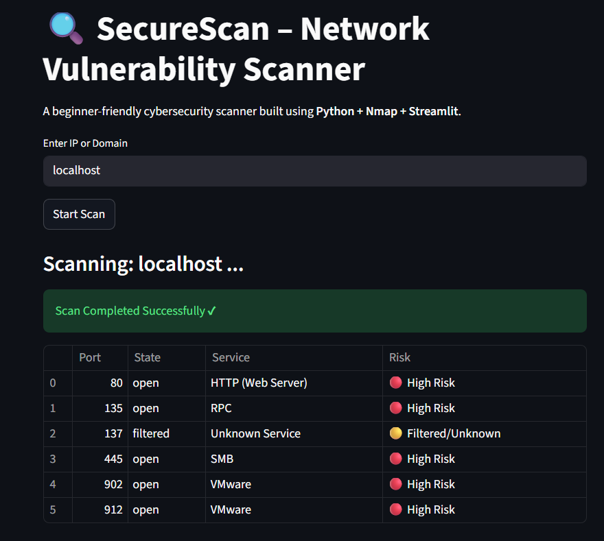

# 🔐 SecureScan – Basic Network Port Scanner

SecureScan is a lightweight Python-based tool that scans common ports (1–1024) on a target system and highlights open ports with simple risk explanations.  
It is designed as a beginner-friendly project to understand the fundamentals of network scanning and basic vulnerability exposure.

---

## Features
- Scan ports **1–1024** on any IP or domain  
- Detect **open**, **closed**, and **filtered** ports  
- Show simple **risk messages** for open ports  
- Built on top of the **Nmap** scanning engine  
- Easy to use, minimal setup

---

## 📦 Requirements

```bash
Python 3.x
Nmap installed on system
python-nmap library
```
- Install Dependency:
```bash
pip install python-nmap
```
- Enter a target IP such as :
```text
localhost
127.0.0.1
```

### Output



